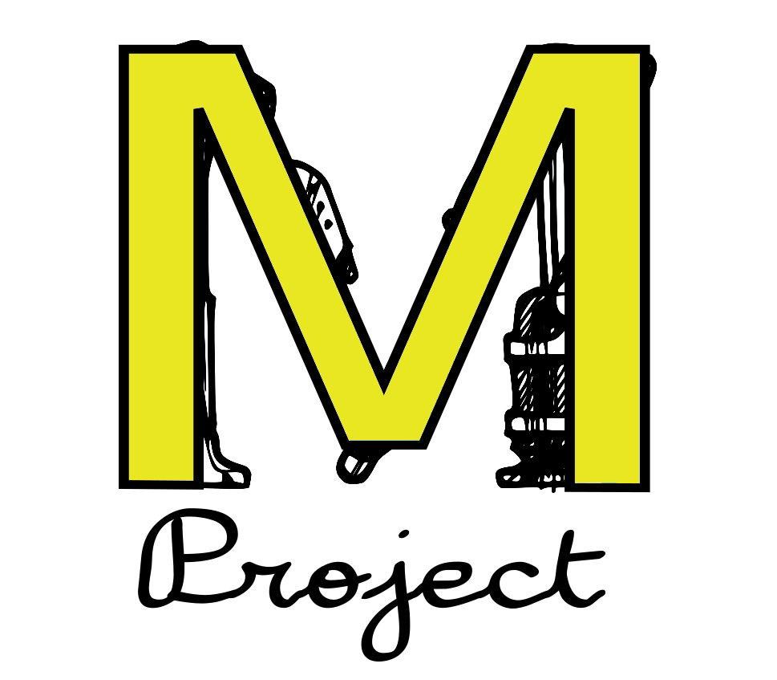

<div align="center">  </div>

# Morfeas Web
This is the Repository for the Morfeas Web, sub-project of the Morfeas Project.

### Requirements
For compilation and usage of this project the following dependencies required.
* [Morfeas_core](https://gitlab.com/fantomsam/morfeas_project) - The core of the Morfeas project.
* [Apache2](https://www.apache.org/) - The Apache WEB server.
* [PHP](https://www.php.net/) - The PHP scripting language.
* [libapache2-mod-php](https://packages.debian.org/stretch/libapache2-mod-php) - The PHP module for the Apache 2 webserver.
* [php-dev](https://packages.debian.org/sid/php/php-dev) - Collection of Headers and other PHP needed for compiling additional modules.
* [php-xml](https://sourceforge.net/projects/xmlphp) -  A class written in php to create, edit, modify and read XML documents.
* [php-mbstring](https://packages.debian.org/stretch/php-mbstring) - PHP module for manipulation of Multibyte String (UNICODE, etc).

The Morfeas_core must spit the logstats at the `/mnt/ramdisk`. Where is mounted a dedicated `tmpfs`.

### Get the Source
```
$ # Clone the project's source code
$ git clone https://gitlab.com/fantomsam/morfeas_web Morfeas_web
$ cd Morfeas_web
$ # Get Source of the submodules
$ git submodule update --init --recursive --remote --merge
```
### Compilation and installation of the submodules
#### pecl-dbus
```
$ cd pecl-dbus
$ phpize
$ ./configure
$ make -j$(nproc)
$ sudo make install
```
To enable php-dbus:
Add `extension=dbus` at the extensions section of php.ini file for apache. Usually located at `/etc/php/X.XX/apache2/`

<!-- ### Installation of the Morfeas-Web Project
```
$ sudo chmod +x ./install.sh
$ ./install.sh
``` -->
## Documentation
The documentation of the project located at [Morfeas_WEB_Docs](./Docs/Morfeas_WEB_Docs).

# License
The subproject license under [AGPLv3](./Morfeas_WEB/LICENSE) or later
# LOG_WEB
